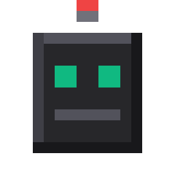
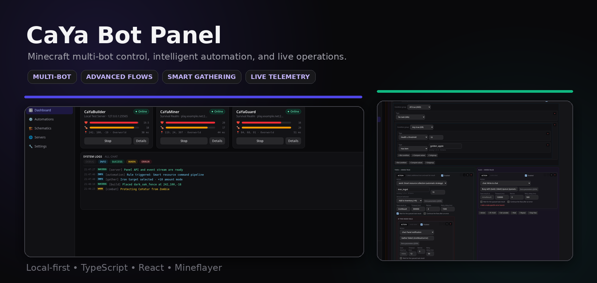
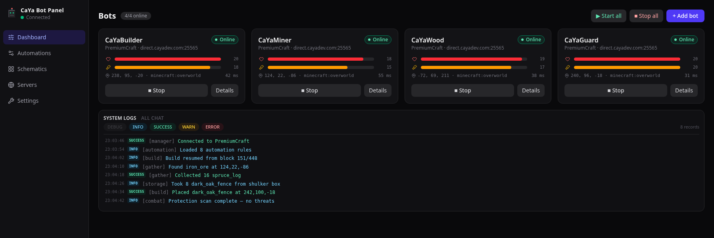
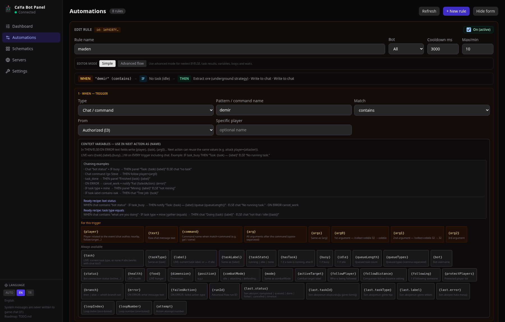
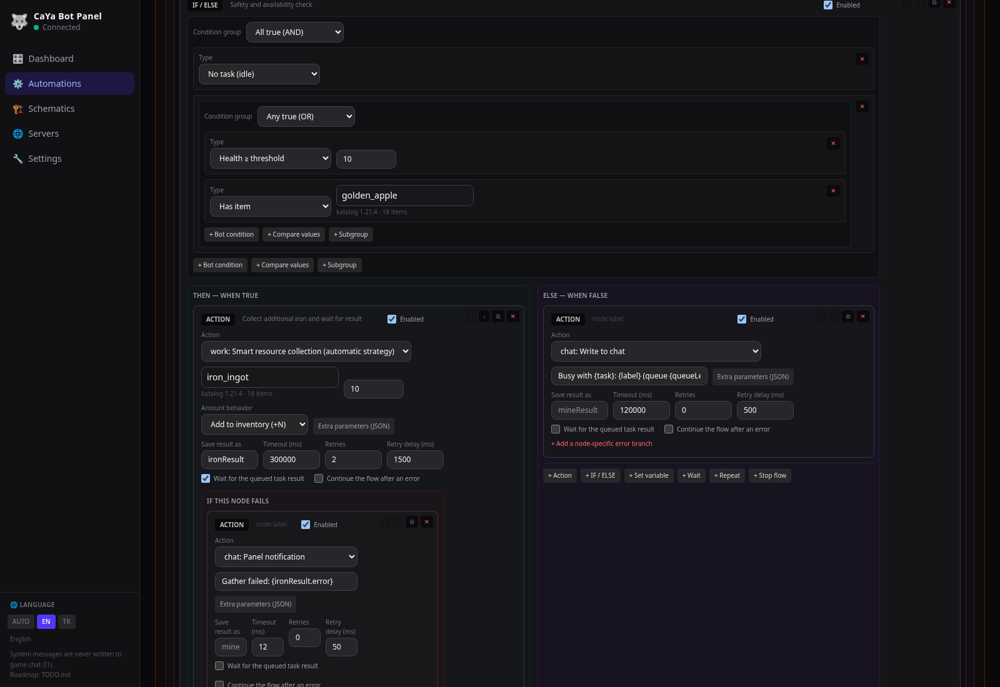
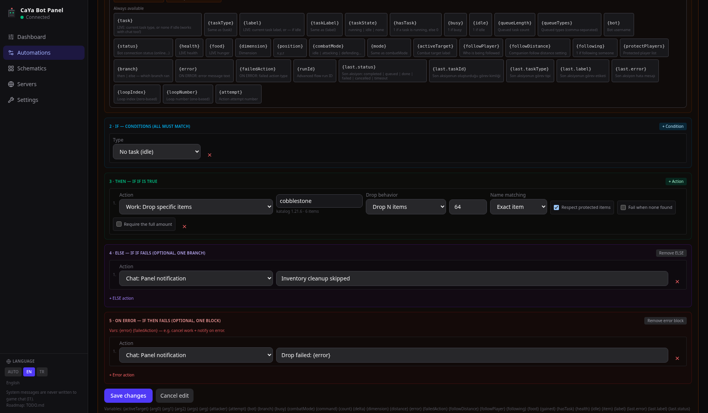
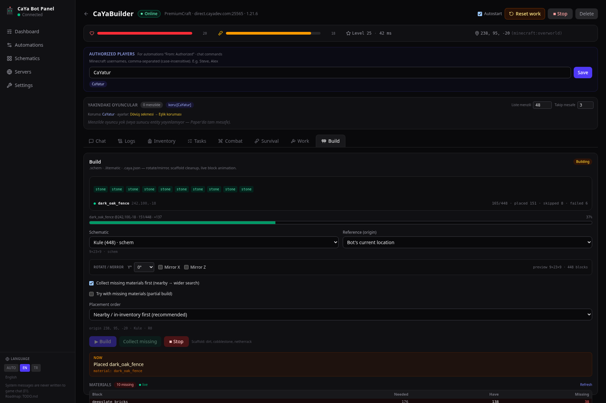
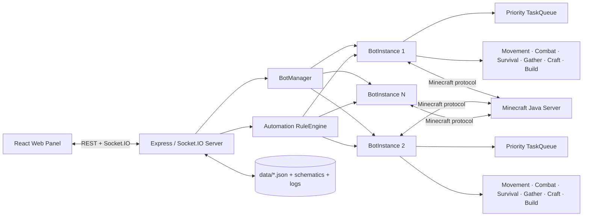

<p align="center">
  
</p>

<h1 align="center">Minecraft CaYa Bot Panel</h1>

**A browser-based, multi-bot control and automation panel for Minecraft Java Edition, powered by Mineflayer.**

[](https://nodejs.org/)
[](https://www.typescriptlang.org/)
[](https://react.dev/)
[](https://github.com/PrismarineJS/mineflayer)
[](https://www.minecraft.net/)
[](#project-status)

---

## Easy installation

### Requirements

- **Node.js 18 or newer** — Node.js 22 LTS is recommended.
- A **Minecraft Java Edition** server that you own or are allowed to use bots on.
- The current bot login mode is **offline authentication**. Premium/Microsoft authentication is not implemented yet.

### 1. Download and install

```bash
git clone https://github.com/CaYatur/Minecraft-CaYa-Bot-Panel.git
cd Minecraft-CaYa-Bot-Panel
npm install
```

### 2. Start the panel

```bash
npm run dev
```

Open:

- **Web panel:** `http://localhost:3000`
- **API and Socket.IO:** `http://localhost:3001`

### 3. Connect your first bot

1. Open **Servers** and create a server profile.
2. Return to **Panel** and select **Add Bot**.
3. Choose the server, bot username, and Minecraft version.
4. Start the bot and open its detail page.

> The server listens on `127.0.0.1` by default. This is intentional: the panel has powerful bot-control endpoints and should not be exposed publicly without an authentication layer and a reverse proxy.

### Production build

```bash
npm run typecheck
npm run build
npm run start -w server
```

After a production build, the Node.js server serves the compiled web interface from:

```text
http://localhost:3001
```

Optional server environment variables:

```text
CAYA_HOST=127.0.0.1
CAYA_PORT=3001
```

---

## Screenshots

> Captured directly from the current application interface in **English** using seeded local demonstration data. The screenshots do not contain real server credentials or private player data.

<p align="center">
  
</p>

### Multi-bot dashboard and live system logs

Monitor bot status, health, hunger, position, latency, active work, and application events from one screen.

<p align="center">
  
</p>

### Advanced automation rule configuration

Configure trigger permissions, cooldowns, concurrency policy, runtime limits, initial variables, and reusable event context.

<p align="center">
  
</p>

### Nested IF/ELSE and task-result flow

Build nested `AND`/`OR` condition groups, wait for queued work, save results, retry failed actions, and branch by task status.

<p align="center">
  
</p>

### Drop-specific-items automation

Drop an exact amount, every matching stack, or only the amount above a retained inventory threshold. Protected items can be preserved and the discarded count can be used by later nodes.

<p align="center">
  
</p>

### Schematic construction

The build workspace includes transforms, origin selection, live progress, material deficits, partial-build behavior, collection controls, and scaffold cleanup.

<p align="center">
  
</p>

---

## What is CaYa Bot Panel?

CaYa Bot Panel is a local web application for creating and operating multiple Minecraft Java bots from one interface. It combines live bot monitoring, inventory management, movement, combat, survival behavior, resource gathering, recursive crafting, schematic construction, and a programmable automation engine.

The project is designed around three principles:

1. **Visible state:** chat, logs, inventory, tasks, health, position, combat, build progress, and errors are shown in the panel in real time.
2. **Task-oriented behavior:** long-running operations are placed into a priority-aware task queue instead of being executed as uncontrolled background loops.
3. **Permission and realism:** chat-controlled automations can be restricted to authorized players, and movement/combat behavior is designed to remain physically achievable by a normal player.

---

## Main features

| Area | Capabilities |
|---|---|
| **Multi-bot management** | Multiple bot profiles, multiple server profiles, start/stop all, autostart, reconnect handling, independent runtime state |
| **Live dashboard** | Connection state, health, hunger, XP, ping, dimension, coordinates, current task, queue, system logs and combined chat |
| **Chat** | Live Minecraft chat, panel-to-server messages, parsed player/server lines, rate limiting and authorized command senders |
| **Inventory** | Live equipment, main inventory and hotbar, equip/use actions, drop-specific automation, protected-item policies and best-gear support |
| **Movement** | Go to coordinates, follow players, waypoints, sprint control, humanized turning, edge safety, bridging, parkour and ladder/vine handling |
| **Water movement** | Surface assistance, current handling, ascent support and more stable water-to-land transitions |
| **Combat** | Attack, self-defense, flee, protect players, target tracking, hostile-mob clearing, configurable reach/reaction/CPS behavior |
| **Survival** | Auto-eat, food acquisition, water safety, hazard escape, bucket handling and configurable fall protection |
| **Smart gathering** | Separate surface and underground strategies, wood collection, ore mining, arbitrary block collection and dropped-item pickup |
| **Farming** | Till soil with a hoe, plant/harvest/replant wheat, carrots, potatoes, beetroot, melon and pumpkin, and run a continuous farm loop that deposits produce into a chosen chest — from the panel, automations or the AI agent |
| **Recursive crafting** | Recipe dependency planning, raw-material acquisition, crafting-table use, furnace chains and storage withdrawal |
| **Storage** | Chests, trapped chests, barrels, placed shulker boxes and temporary use/recovery of portable shulker boxes — deposits are verified (chest-full is reported honestly) and a specific chest can be targeted by coordinates |
| **Schematic building** | `.schem`, `.schematic`, `.litematic` and `.caya.json`, rotation, mirroring, material planning, partial building and scaffold cleanup |
| **AI agent (MCP + Ollama)** | Drive bots with an LLM: a local Ollama model plays in-game (chat replies, tasks, creative building) or any MCP client (Claude Code, Cursor, VS Code…) uses the bots as tools — 50+ tools, trust system, persistent memory, autopilot |
| **Advanced automations** | Nested IF/ELSE, AND/OR/NOT groups, variables, task-result capture, loops, waits, retries, timeouts and error branches |
| **Localization** | English, Turkish and automatic locale detection |
| **Persistence** | Server profiles, bot profiles, rules, waypoints, schematic indexes and logs stored locally as JSON/files |

---

## MCP / AI agent system

The **MCP / AI** tab connects the bots to a language model in two independent ways. Both paths share the same tool registry (50+ tools), and every tool executes through the normal task queue and realism layers — the model can only do what a player could do through the panel.

```text
┌─────────────────────┐      tools       ┌──────────────────┐
│ Ollama (local LLM)  │ ───────────────► │                  │
│ in-game agent       │                  │  Agent tool      │      TaskQueue /
└─────────────────────┘                  │  registry (50+)  │ ───► RealismLayer ───► Minecraft
┌─────────────────────┐   /mcp endpoint  │                  │
│ Claude Code, Cursor │ ───────────────► │                  │
│ VS Code, any client │  (JSON-RPC/HTTP) └──────────────────┘
└─────────────────────┘
```

Enable the master switch in **MCP / AI**, then use either or both modes.

### Mode 1 — In-game AI with Ollama

A local [Ollama](https://ollama.com) model drives the bot inside the game: it answers chat, accepts tasks, gathers, crafts, fights (if allowed) and designs/builds structures.

1. Install Ollama and pull a **tool-capable** model:

   ```bash
   ollama pull qwen2.5        # or: llama3.1, qwen3, mistral-nemo, gpt-oss
   ```

2. In **MCP / AI → Ollama**, pick the model (the dropdown lists your installed models) and enable the agent.
3. Under **Bot Agents**, toggle **Agent** on for at least one bot.
4. Talk to it from the **Agent Chat** console — or in game chat by addressing the bot by name (`CaYa selam, 10 demir kaz`).

In-game behavior is fully configurable: reply only when addressed, whisper handling, per-player cooldown, max reply length, persona text and reply language. Turning **in-game replies off** limits conversation to the panel's Agent Chat.

> Small models (≤8B) can misuse tools or hallucinate. For serious use prefer stronger tool-calling models such as `qwen3.5:35b` or `gpt-oss:20b`.

### Mode 2 — External MCP clients (Claude Code, Cursor, VS Code…)

The panel exposes a **Model Context Protocol** server at `http://127.0.0.1:3001/mcp` (Streamable HTTP, JSON-RPC 2.0). Any MCP-capable tool can then control the bots.

**Claude Code (CLI):**

```bash
claude mcp add --transport http caya-bot http://127.0.0.1:3001/mcp
```

**Cursor** — `.cursor/mcp.json` (project) or `~/.cursor/mcp.json` (global):

```json
{ "mcpServers": { "caya-bot": { "url": "http://127.0.0.1:3001/mcp" } } }
```

**VS Code (Copilot agent mode)** — `.vscode/mcp.json`:

```json
{ "servers": { "caya-bot": { "type": "http", "url": "http://127.0.0.1:3001/mcp" } } }
```

**Windsurf** — `~/.codeium/windsurf/mcp_config.json`:

```json
{ "mcpServers": { "caya-bot": { "serverUrl": "http://127.0.0.1:3001/mcp" } } }
```

**Gemini CLI** — `~/.gemini/settings.json`:

```json
{ "mcpServers": { "caya-bot": { "httpUrl": "http://127.0.0.1:3001/mcp" } } }
```

**Claude Desktop and other stdio-only clients** — bridge with [`mcp-remote`](https://www.npmjs.com/package/mcp-remote) in the client's MCP config:

```json
{
  "mcpServers": {
    "caya-bot": {
      "command": "npx",
      "args": ["-y", "mcp-remote", "http://127.0.0.1:3001/mcp"]
    }
  }
}
```

> Config formats evolve — if a snippet doesn't match your client version, the only facts you need are: **transport = Streamable HTTP**, **URL = `http://127.0.0.1:3001/mcp`**. When *Require bearer token* is enabled in the panel, also send `Authorization: Bearer <token>` (Claude Code: `--header "Authorization: Bearer <token>"`; JSON configs usually accept a `headers` object).

Most tools accept an optional `bot` argument; when exactly one bot has the agent enabled it is picked automatically. Typical session: `list_bots` → `get_status` → `mine_ore { ore: "iron", count: 10 }` → `get_tasks`.

### Tool categories

Every category can be toggled in **Tool Permissions**; info/perception tools are always on.

| Category | Tools |
|---|---|
| Info / perception (always on) | `list_bots`, `get_status`, `get_inventory`, `look_around`, `find_blocks`, `get_recent_chat`, `get_tasks`, `get_build_status`, `list_waypoints`, `list_schematics`, `list_trusted_players`, `stop_all` |
| Chat | `send_chat`, `send_whisper` |
| Movement | `goto`, `goto_player`, `follow_player`, `goto_waypoint`, `interact_block` |
| Gathering | `collect_wood`, `mine_ore`, `collect_blocks`, `collect_drops`, `hunt_animals` |
| Farming | `till_soil`, `plant_crops`, `harvest_crops`, `farm_cycle` (continuous farm loop with chest deposit) |
| Crafting & survival | `craft_item`, `preview_craft_plan`, `cook_food`, `eat_now`, `sleep_in_bed`, `wake_up` |
| Inventory / storage | `deposit_items`, `withdraw_items`, `give_item_to_player`, `drop_items`, `equip_item` |
| Building (creative) | `plan_structure`, `build_structure`, `build_schematic`, `stop_build` |
| Defense | `set_self_defense`, `protect_player`, `flee`, `stop_combat` |
| Attack *(off by default)* | `attack_player`, `clear_hostile_mobs` |
| Trust | `trust_player`, `untrust_player` |
| Memory | `remember`, `recall_memories`, `forget_memory` |
| Waypoints | `save_waypoint_here` |
| Utility mode *(off by default)* | `server_command`, `fly_to`, plus `mine_ore { utility: true }` |

### Creative building without schematics

The model designs structures itself by composing parametric shapes — `box`, `hollow_box`, `floor`, `wall`, `pillar`, `line`, `cylinder`, `ring`, `sphere`, `dome`, `pyramid`, `cone`, `stairs`, `roof_gable` and raw `blocks`. Placing `air` carves earlier cells, which gives it doors, windows and interiors. `plan_structure` dry-runs the design (size + material list vs. inventory), `build_structure` hands it to the real build engine (scaffolding, material collection, progress, repair) and `get_build_status` streams stage-by-stage progress back to the model. Designs are saved into the schematic library as `AI · <name>`, and existing library schematics can be built with `build_schematic`.

### Trust system

When the trust system is on, only players in the trusted list can give the agent commands from game chat. Untrusted players are either ignored or get chat-only replies (no tools) — configurable. The model itself may manage the list with `trust_player` only if you explicitly allow it.

### Autopilot

Give a bot a goal (*"collect 64 oak logs, then build a small cabin"*) and enable **Autopilot**: the model periodically decides the next concrete step on its own, wakes early on task completion/failure or when attacked, and stops when it reports the goal complete.

### Utility mode (permitted servers only)

Off by default. On your **own** server (or one that explicitly allows automation) you can unlock non-realistic paths for the model: server slash commands (`/tp`, `/give`, `/gamemode`… — requires OP), creative flight (`fly_to`) and fast utility mining. Combat realism (look-before-hit, reach, human timing) is **never** affected by this mode.

### Memory

`remember` / `recall_memories` give each bot a persistent long-term memory (`data/agent-memory/`) that survives restarts — base locations, owners, promises.

---

## Advanced automation engine

The automation system can be used as a simple trigger-condition-action editor or as a nested workflow engine.

### Triggers

Rules can react to events including:

- Chat text or slash-style commands
- Bot being attacked
- A player entering or leaving range
- A follow target moving out of range
- Player join or leave events
- Health or hunger thresholds
- Item-count thresholds
- Items being gained
- Inventory becoming full
- Timed intervals
- Bot spawn and death
- Task completion or failure

### Conditions

Rules can inspect:

- Online/offline state
- Whether the task queue is idle or busy
- Active task type and task label
- Combat mode and active follow target
- Health and hunger
- Item existence and item count
- Nearby or distant players
- Dimension
- Day/night state
- Arbitrary values and previous action results

Advanced flows support nested condition groups:

```text
ALL
├─ bot is idle
├─ health >= 12
└─ ANY
   ├─ iron_ingot count < 32
   └─ {forceRun} is truthy
```

The available group operators are:

- `ALL` — every child must be true
- `ANY` — at least one child must be true
- `NOT` — invert a nested condition

### Flow nodes

The visual advanced editor supports:

- **Action** — run a bot action
- **IF / ELSE** — create nested conditional branches
- **Set variable** — store a value in the workflow context
- **Wait** — wait for a duration or until a condition is true
- **Repeat** — fixed-count or conditional loops
- **Stop flow** — complete or fail the workflow deliberately

Each action node can also define:

- A result variable name
- Whether to wait for the created task to finish
- Timeout
- Retry count
- Delay between retries
- Continue-on-error behavior
- A node-specific error branch

### Task-result branching

An action can store its result under a custom name:

```text
saveAs: ironResult
waitForTask: true
```

Later nodes can read:

```text
{ironResult.status}
{ironResult.taskId}
{ironResult.taskType}
{ironResult.label}
{ironResult.error}
{ironResult.progressDone}
{ironResult.progressTotal}
```

Typical statuses include:

```text
completed · queued · done · failed · cancelled · timeout
```

### Example workflow

```text
WHEN authorized player sends: /iron 10

IF bot is idle
  ACTION Smart collect iron_ingot
    count: {arg0}
    amount mode: add
    wait for task: yes
    save result as: ironResult

  IF {ironResult.status} equals done
    SEND CHAT: Collected {arg0} additional iron.
  ELSE
    PANEL NOTIFY: Iron task failed: {ironResult.error}
ELSE
  SEND CHAT: I am currently busy with {task}: {label}.
```

### Context variables

Common variables available to rules include:

```text
{player}             chat sender or related player
{text}               raw chat message
{command}            parsed command name
{arg}, {arg0}...     command arguments
{task}, {taskType}   active task type
{label}               active task label
{taskState}           running, idle, none...
{busy}, {idle}        numeric state flags
{queueLength}         queued task count
{queueTypes}          comma-separated task types
{health}, {food}      current vitals
{position}            x,y,z
{dimension}           current dimension
{combatMode}          current combat mode
{activeTarget}        combat target
{followPlayer}        followed player
{branch}              then or else
{error}               current error message
{failedAction}        action that failed
{last.status}         previous action result
{loopIndex}           zero-based loop index
{loopNumber}          one-based loop index
{attempt}             retry attempt number
{runId}               advanced-flow run identifier
```

Rules are protected by cooldown and maximum-trigger-per-minute settings. Advanced flows additionally support a maximum runtime, maximum step count, and concurrency policy.

---

## Smart resource gathering

Gathering is strategy-aware. The bot does not treat every item as an ore and does not use the same pathing policy for trees and underground resources.

### Surface resources

For logs and similar surface resources, the gatherer prioritizes:

- Nearby dropped items
- Visible matching trees or blocks
- Surface-friendly paths
- The lowest reachable log in a tree
- Connected logs from the same tree
- Temporary blacklisting of unreachable targets

Terrain tunneling is disabled for normal wood collection, preventing the bot from mining through mountains just to reach a tree.

### Underground resources

Ore collection uses a separate strategy that can allow controlled digging and underground pathfinding. Unreachable or invalid targets are not chased indefinitely.

### Amount modes

Gather and mining actions expose two different amount semantics:

| Mode | Example with 10 items already in inventory |
|---|---|
| **Add `+N`** | Request 10 → final target is 20 |
| **Target total `N`** | Request 10 → task is already complete |

This distinction is important for automation commands versus build/craft dependency planning.

### Dropped items

The bot can collect item entities produced by mining, tree cutting, crafting, combat, or manual drops. Collection is verified against inventory changes rather than assuming that walking near an entity succeeded.

---

## Crafting and dependency planning

The smart crafting layer recursively resolves recipes and their source materials.

Examples:

```text
spruce_planks
└─ spruce_log

dark_oak_fence
├─ dark_oak_planks
│  └─ dark_oak_log
└─ sticks
   └─ planks

iron_ingot
├─ raw_iron / iron_ore
└─ furnace fuel
```

The planner can:

- Use items already in inventory
- Pick up nearby dropped items
- Withdraw from nearby storage
- Resolve and craft intermediate ingredients
- Gather missing raw materials
- Use furnace-based production when required
- Continue a larger build or task after materials become available

---

## Storage and shulker-box support

The storage layer can search and withdraw matching materials from:

- Chests
- Trapped chests
- Barrels
- Shulker boxes placed in the world
- Shulker boxes carried in the bot inventory

World storage is opened but not destroyed. A portable shulker can be placed temporarily at a safe position, opened, used, and then broken and collected again. If recovery cannot be verified, the operation fails visibly instead of silently losing the box.

---

## Schematic building

Supported formats:

```text
WorldEdit:   .schem / .schematic
Litematica:  .litematic
CaYa JSON:   .caya.json
```

The build system provides:

- Schematic library and upload interface
- Size and block-count preview
- Rotation: `0°`, `90°`, `180°`, `270°`
- Mirror X and Mirror Z
- Bot-position or custom origin
- Nearby-first or layer-first placement
- Live block animation and recent-block history
- Real-time material requirements
- Automatic missing-material collection
- Partial building when not every material is available
- Crafting and storage integration
- Scaffold block configuration
- Scaffold cleanup
- Placed, skipped and failed counters
- Cancellation and task interruption recovery

Temporary placement failures can be retried. Material usage and the remaining material table are updated during the build rather than being calculated only once at the beginning.

---

## Movement system

The movement layer is built around `mineflayer-pathfinder` with additional project-level safety and stability logic.

Capabilities include:

- Go to coordinates
- Follow a player with configurable distance
- Saved waypoints
- Controlled sprint behavior
- Smooth/humanized turning
- Stuck detection and route refresh
- Edge and drop safety
- Optional gap bridging
- Parkour attempts before bridging
- Configurable 2–4 block gap handling
- Ladder, vine and scaffolding climbing
- Water-current and surface assistance
- Controlled digging and scaffold policies per task type

Movement ownership is coordinated between pathfinding, combat, building, survival, and manual controls to reduce conflicting look or key-state updates.

---

## Combat and companion behavior

Combat is configurable per bot.

Available behavior includes:

- Direct player attack
- Hostile-mob clearing
- Self-defense against mobs, players, both, or neither
- Fleeing at a configured health threshold
- Protecting one or more players
- Follow/attack/protect companion toggles
- Target reach, reaction delay, turn speed and CPS limits
- Weapon selection
- Optional nearby-threat cleave behavior
- Death-position and loot-recovery support
- Unreachable-target detection and temporary target suppression

The project intentionally avoids teleporting, attacking through walls, or instantaneous aim snapping.

---

## Survival systems

Survival behavior can be configured separately for each bot:

- Automatic eating below a hunger threshold
- Food blacklist
- Food acquisition, hunting and cooking workflows
- Water-surface and land-seeking guard
- Fire, lava and magma escape logic
- Optional water-bucket use during hazard escape
- Empty-bucket water/lava collection
- Fall-risk estimation
- MLG-style landing attempts when suitable items and surfaces are available
- Optional recovery of placed water, boats or blocks

Fall protection is best-effort and depends on latency, available inventory, the server tick rate, anti-cheat behavior, and the geometry below the bot.

---

## Inventory and chat

### Inventory

The panel displays:

- Armor slots
- Offhand
- Main inventory
- Hotbar and selected slot
- Stack count
- Durability
- Enchantments

Available actions include selecting, equipping and using items, together with configurable keep/banned-item policies.

#### Drop-specific-items automation

Automation rules can remove inventory items without relying on a generic full-stack drop command. The action supports:

- **Drop `N` items** — discard up to an exact requested amount
- **Drop all matches** — discard every matching inventory stack
- **Keep `N`, drop the excess** — retain a minimum stock and discard only the surplus
- **Exact name** or **name contains** matching
- Optional protection for items in the bot's `keepItems` list
- Optional failure when no matching item exists
- Optional full-amount enforcement
- Task-result capture through fields such as `{dropResult.status}` and `{dropResult.progressDone}`

Equipment and offhand slots remain protected. Because dropping is irreversible, interrupted drop tasks are not silently requeued.

### Chat

The chat interface separates Minecraft chat from internal application logs. System errors and task diagnostics stay in the panel unless a user-created automation explicitly sends a Minecraft message.

Chat-triggered rules can be restricted to each bot's **authorized player list**. A global rate limiter reduces spam and kick risk.

---

## Full cancellation and task priorities

The task system follows a priority model similar to:

```text
survival emergency
> self-defense
> direct user command
> automation work
> idle behavior
```

A full cancellation operation stops more than the visible queue. It also invalidates active automation runs, clears movement goals, releases control states, cancels digging/build helpers, and prevents the same automation from immediately recreating the task during a short suppression window.

---

## Architecture



### Technology stack

| Layer | Technology |
|---|---|
| Bot runtime | Mineflayer |
| Pathfinding | mineflayer-pathfinder |
| Tool selection | mineflayer-tool |
| Armor handling | mineflayer-armor-manager |
| Schematic parsing | prismarine-schematic, prismarine-nbt |
| Backend | Node.js, Express, Socket.IO, TypeScript |
| Frontend | React, React Router, Zustand, Vite, Tailwind CSS |
| Persistence | Local JSON and file storage |

---

## Project structure

```text
Minecraft-CaYa-Bot-Panel/
├─ data/                         Local persistent state
│  ├─ bots.json
│  ├─ servers.json
│  ├─ rules.json
│  ├─ waypoints.json
│  ├─ schematics/
│  └─ logs/
├─ scripts/                      Smoke and behavior test scripts
├─ server/
│  └─ src/
│     ├─ api/                    REST and Socket.IO adapters
│     ├─ constants/              Shared event names
│     ├─ core/                   BotManager, BotInstance, TaskQueue
│     ├─ modules/
│     │  ├─ agent/               MCP endpoint, Ollama agent, tool registry, memory
│     │  ├─ automation/          Rules, blueprints and advanced flow nodes
│     │  ├─ build/               Schematic parsing and construction
│     │  ├─ catalog/             Minecraft item/block catalog
│     │  ├─ chat/                Chat parsing
│     │  ├─ combat/              Combat and companion behavior
│     │  ├─ craft/               Crafting and recursive dependency planning
│     │  ├─ gather/              Surface, ore and drop gathering
│     │  ├─ inventory/           Inventory actions and snapshots
│     │  ├─ movement/            Pathfinding, parkour and water assistance
│     │  ├─ survival/            Food, hazard, water and fall guards
│     │  └─ world/               Shared world memory
│     ├─ persistence/            JSON store helpers
│     ├─ types.ts
│     └─ index.ts
├─ test-server/                  Local Flying Squid test server
├─ web/
│  └─ src/
│     ├─ components/             Bot panels and advanced flow editor
│     ├─ i18n/                   English and Turkish dictionaries
│     ├─ lib/                    API, sockets and shared UI types
│     ├─ pages/                  Dashboard, bots, rules, schematics, MCP/AI, servers
│     ├─ stores/                 Zustand state
│     └─ App.tsx
├─ TODO.md                       Detailed roadmap and design decisions
├─ package.json                  npm workspaces and root scripts
└─ README.md
```

---

## Commands

| Command | Purpose |
|---|---|
| `npm run dev` | Start backend and web panel in development mode |
| `npm run dev:server` | Start only the backend |
| `npm run dev:web` | Start only the Vite frontend |
| `npm run typecheck` | Run strict TypeScript checks in both workspaces |
| `npm run build` | Build backend and frontend for production |
| `npm run start -w server` | Start the compiled production server |
| `npm run testserver` | Start the local offline test server on `127.0.0.1:25566` |
| `npm run smoke` | Run an end-to-end smoke test |
| `npm run test:combat` | Run combat-focused checks |
| `npm run test:full` | Run the broader behavior suite |
| `npm run test:grok` | Run the extended smoke suite included in the repository |
| `npm run test:all` | Run the complete scripted test chain |

---

## Local test server

A lightweight offline test server is included for development:

```bash
npm run testserver
```

It listens on:

```text
127.0.0.1:25566
```

Then, in a second terminal:

```bash
npm run dev
npm run smoke
```

See [`test-server/README.md`](test-server/README.md) for additional test-server guidance.

---

## Data and backups

Runtime data is stored under `data/`. Keep backups of this directory before large migrations or experimental changes.

Important files include:

```text
data/servers.json       server profiles
data/bots.json          bot profiles and per-bot settings
data/rules.json         automation rules and advanced flows
data/waypoints.json     saved coordinates
data/schematics/        uploaded schematic files and index
data/logs/              application logs
```

Do not commit real server addresses, private player lists, or sensitive operational data to a public repository.

---

## Security notes

- The API binds to `127.0.0.1` by default.
- There is currently no multi-user login or role-based web authentication.
- Do not expose port `3001` directly to the public internet.
- Restrict chat-command automations to authorized player names.
- Review automation rules before enabling them on a production server.
- Keep destructive inventory and build actions behind explicit conditions.
- Use bots only on servers you own or where bot use is permitted.

---

## Troubleshooting

### `npm install` or native package errors

Remove dependencies and reinstall them on the same operating system that will run the project:

**Windows PowerShell:**

```powershell
Remove-Item -Recurse -Force node_modules
Remove-Item -Recurse -Force server/node_modules -ErrorAction SilentlyContinue
Remove-Item -Recurse -Force web/node_modules -ErrorAction SilentlyContinue
npm install
```

Do not copy `node_modules` between Windows, Linux, macOS, WSL or Docker. Packages such as Esbuild and Rollup use platform-specific binaries.

### Panel opens but API is disconnected

Check that the backend is running on port `3001` and that another application is not using the port.

```bash
npm run dev:server
```

### Bot cannot join

Check:

- Host and port
- Selected Minecraft version
- Server online/offline authentication mode
- Username validity
- Whitelist and ban state
- ViaVersion/proxy behavior
- Kick reason in the bot log panel

### Bot repeats a failed task

Use **Reset work** or the full-cancel action. Then inspect the active automation rules, especially interval, task-failed and error branches that may recreate work.

### Bot stuck after cancelling a build

**Stop** and **Reset work** free the bot within a couple of seconds even when a server request hangs mid-flight: cancelled runners that don't unwind are force-detached from the task queue (logged as *"Task force-detached"*), all placement/equip/window operations run under hard timeouts, and pathfinder is repeatedly released until the engine fully exits. If you still see movement after a reset on some server, capture the log panel output and open an issue.

### AI agent doesn't respond

- Master switch **and** Ollama must both be enabled, a model selected, and **Agent** toggled on for the bot.
- The model must support tool calling (`llama3.1`, `qwen2.5/3`, `mistral-nemo`, `gpt-oss`…). Plain chat models fail with a clear error.
- In-game replies additionally require *Reply to in-game messages* and (by default) addressing the bot by name; whispers always count.
- For external MCP clients, the `/mcp` endpoint toggle must be on — a disabled endpoint returns HTTP 403.

### Building reports missing materials

Check whether the material is:

- Already in inventory
- Available in nearby chest/barrel/shulker storage
- Craftable from another material
- Obtainable in the current dimension and search radius
- A block state that requires special placement support

### Fall protection still fails

MLG behavior is sensitive to latency, server TPS, inventory selection, anti-cheat rules and complex landing surfaces. Treat it as emergency assistance, not guaranteed immunity.

---

## Current limitations

- Minecraft **Bedrock Edition** is not supported.
- Microsoft/premium authentication is not implemented in the current bot connection flow.
- The web panel does not yet include user accounts or remote-access security.
- JSON persistence is intended for local/small deployments; a database may be preferable for large installations.
- Minecraft physics and anti-cheat behavior vary between server implementations and versions.
- Some complex blocks and redstone-oriented schematic states may require additional placement handlers.
- Automated combat, movement, MLG and building remain best-effort systems and should be monitored during real-server use.

---

## Project status

CaYa Bot Panel is under active development. The repository currently contains working implementations for multi-bot lifecycle management, chat, inventory, task queues, movement, combat, survival, gathering, crafting, storage, schematic construction, localization and advanced automation flows.

The detailed development plan, acceptance criteria, design principles and future backlog are maintained in [`TODO.md`](TODO.md).

---

## Contributing

Contributions are welcome through issues and pull requests.

Before submitting a change:

```bash
npm install
npm run typecheck
npm run build
npm run test:all
```

Recommended contribution rules:

1. Keep server and web types synchronized.
2. Add new Socket.IO event names to the shared event definitions.
3. Keep user-facing strings in the English and Turkish i18n dictionaries.
4. Do not send internal logs to Minecraft chat automatically.
5. Respect task cancellation tokens in long-running operations.
6. Avoid look, movement and pathfinder ownership conflicts.
7. Document new behavior and configuration fields.
8. Add a targeted test for fixed regressions when possible.

---

## Responsible use

This software is intended for personal servers, development environments and servers where automation is explicitly permitted. Server owners may prohibit bots, automated combat, resource gathering or schematic building. You are responsible for following the rules of every server you connect to.

---

## License
Developed by CaYaDev (ÇAĞAN TURGUT)
[`MIT License`](LICENSE)

---

<p align="center">
  Built for Minecraft Java automation, experimentation and local server management.
</p>
